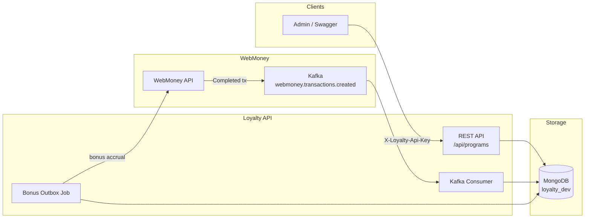
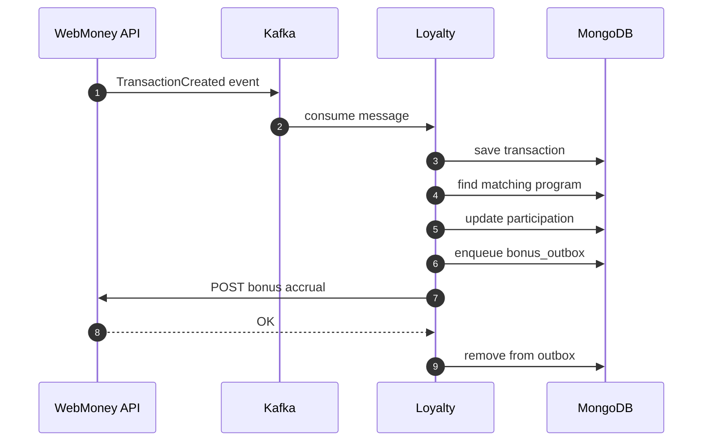
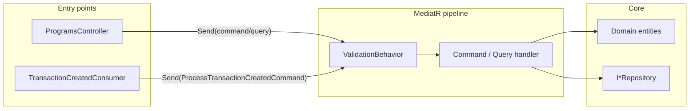
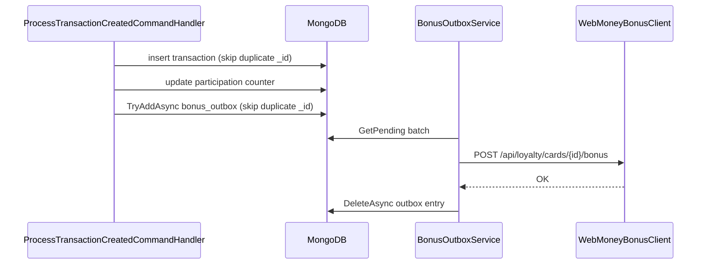
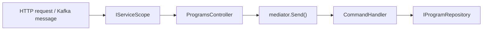
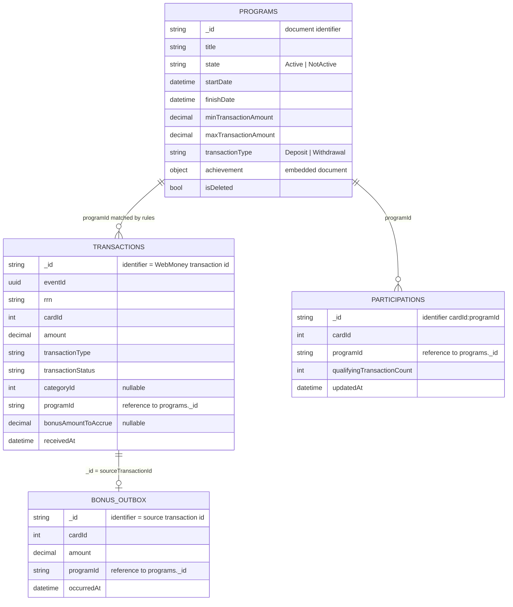
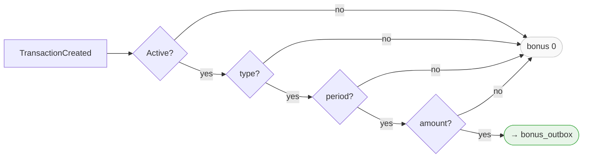

# Loyalty

*Loyalty programs, Kafka transaction processing, and bonus accrual to cards.*

---

## About

Loyalty is a backend service for WebMoney. Administrators manage programs via REST API. When a transaction completes in WebMoney, an event is published to Kafka; Loyalty matches a program, calculates the bonus, and calls WebMoney to accrue it.

**Stack:** .NET 10 · MongoDB · Kafka · MediatR · FluentValidation · DI · Serilog · Outbox

---

## Structure

### Projects

| Project | Role |
|---|---|
| `Loyalty.Domain` | Model and Rules |
| `Loyalty.Application` | Handlers, Business logic, MediatR, Fluent Validation |
| `Loyalty.Infrastructure` | MongoDB, Kafka, WebMoney, Outbox |
| `Loyalty.Api` | HTTP API |
| `Loyalty.Api.UnitTests` | Tests |

### Runtime components

| Component | Purpose |
|---|---|
| REST API | Program CRUD (`/api/programs`) |
| Kafka consumer | Topic `webmoney.transactions.created` |
| Bonus outbox job | Async bonus delivery to WebMoney |

Event contracts — **WebMoney.Loyalty.Events** package.

---

## Architecture

### System context



### Bonus accrual flow



### Solution layers

```mermaid
flowchart TB
    subgraph Api["Loyalty.Api"]
        Controllers["Controllers + Swagger"]
        Auth["API Key Auth"]
    end

    subgraph App["Loyalty.Application"]
        Handlers["Command / Query handlers"]
        BizLogic["Program matching · bonus calculation"]
        Validators["FluentValidation · pipeline"]
    end

    subgraph Domain["Loyalty.Domain"]
        Entities["Program · Transaction · Participation"]
        Rules["Create · entity invariants"]
    end

    subgraph Infra["Loyalty.Infrastructure"]
        Repos["Mongo repositories"]
        KafkaC["Kafka consumer"]
        WMClient["WebMoney HTTP client"]
        Job["Bonus outbox job"]
    end

    Controllers --> Handlers
    Handlers --> BizLogic
    Handlers --> Domain
    Handlers --> Repos
    KafkaC --> Handlers
    Job --> WMClient
    Repos --> Mongo[(MongoDB)]
```



---

## Design patterns

Loyalty follows **Clean Architecture** with **CQRS** via MediatR. Business logic lives in handlers; controllers and infrastructure adapters stay thin.

### Pattern map

| Pattern | Layer | Key types |
|---|---|---|
| Clean Architecture / Onion | Solution | `Domain` → `Application` ← `Infrastructure` + `Api` |
| CQRS | Application | `ICommand`, `IQuery`, `*CommandHandler`, `*QueryHandler` |
| MediatR | Application | `ServicesCollectionExtensions.AddApplication()` |
| Pipeline Behavior | Application | `ValidationBehavior<TRequest, TResponse>` |
| FluentValidation | Application | `CreateProgramCommandValidator`, `ProcessTransactionCreatedCommandValidator` |
| Thin Controller | Api | `ProgramsController` → `mediator.Send(...)` only |
| Rich Domain | Domain | `Program.Create()`, `Update()`, `Delete()` — immutable returns |
| Repository | Application + Infrastructure | `IProgramRepository` → `ProgramRepository` |
| Document Mapping | Infrastructure | `ProgramDocumentMapper`, `*Document` types |
| DTO Mapping | Application + Api | Domain → `Application.Models.Program` → `Api.Contracts.Program` |
| Transactional Outbox | Infrastructure | `BonusOutboxRepository`, `BonusOutboxService`, `BonusOutboxProcessor` |
| Idempotency | Domain + Infrastructure | Duplicate key on `transactions`, `bonus_outbox` |
| Adapter (HTTP) | Infrastructure | `IWebMoneyBonusClient` → `WebMoneyBonusClient` |
| Custom Auth | Api | `ApiKeyAuthenticationHandler`, `[Authorize]` |
| Problem Details | Api | `GlobalExceptionHandler` → 400 / 404 / 409 |
| Options | Infrastructure | `MongoOptions`, `WebMoneyOptions`, `BonusOutboxJobConfig` |
| BackgroundService | Infrastructure | `TransactionCreatedConsumer`, `BonusOutboxService` |
| Health Check | Infrastructure | `MongoHealthCheck` → `/health` |

### CQRS request flow



### Validation (two layers)

1. **FluentValidation** — input shape and rules before the handler runs (`ValidationBehavior`).
2. **Domain invariants** — business rules inside entities (`Program.Create`, date/amount checks).

`ValidationException` → HTTP 400 with `ValidationProblemDetails`.

### Outbox and idempotency



- Outbox `_id` = source transaction id — safe retries from Kafka and the polling job.
- `TransactionRepository.AddAsync` treats duplicate `_id` as already processed.

### Application services

| Class | Role |
|---|---|
| `ProgramParticipationResolver` | Match transaction to an active program |
| `RewardCalculator` | Compute bonus (`Percent` / `Fixed`, `Target.Bonus`) |
| `ParticipationProgressResult` | Participation counter update result |

### Dependency injection

All services are registered in the same `IServiceCollection` container — whether explicitly (`AddScoped`) or by frameworks (`AddMediatR`, `AddControllers`).

| Lifetime | Registered by | Examples |
|---|---|---|
| **Singleton** | explicit | `IMongoClient`, `IMongoDatabase`, `BonusOutboxProcessor` |
| **Scoped** | explicit | `IProgramRepository`, `ITransactionRepository`, FluentValidation validators |
| **Transient** | framework / explicit | MediatR handlers (`*CommandHandler`), `ValidationBehavior<,>`, `ProgramsController`, `ConfigureSwaggerOptions` |
| **HostedService** | explicit | `TransactionCreatedConsumer`, `BonusOutboxService` (singleton background workers) |

Handlers and controllers are **Transient** (new instance per `Send()` / request), but they resolve **Scoped** repositories inside an active scope:


For Kafka and outbox jobs, the scope is created manually (`CreateScope()`), because HostedService is a singleton and cannot hold scoped dependencies directly.

Registration: `AddApplication()` + `AddInfrastructure(IConfiguration)` extension methods.

### Integration with WebMoney

| Direction | Mechanism | Contract |
|---|---|---|
| Inbound events | Kafka consumer | `WebMoney.Loyalty.Events.TransactionCreatedEvent` |
| Outbound bonus | HTTP + API key | `POST api/loyalty/cards/{cardId}/bonus` |
| Shared secret | Header | `X-Loyalty-Api-Key` |

---

## Database

Database: **`loyalty_dev`** (MongoDB). Four collections.

On the diagram below, **`_id`** is the document identifier; arrows are logical references by field value.




---

## Quick start

### Requirements

- [Docker Desktop](https://www.docker.com/products/docker-desktop/)
- [.NET 10 SDK](https://dotnet.microsoft.com/download) — only if running the API via `dotnet run` (see below)

Loyalty connects to the Docker network **`local-dev-network`**, which is created by the WebMoney infrastructure. **Start WebMoney first, then Loyalty.**

### 1 · WebMoney

From the [WebMoney repository](https://github.com/Qdesnitsa/WebMoney_cs_webmvc), `build/` directory — Postgres, Kafka, API.  
See the [WebMoney README — Quick start](https://github.com/Qdesnitsa/WebMoney_cs_webmvc#quick-start) for details.

The `local-dev-network` network is created when WebMoney infrastructure is brought up with `docker compose up`.

### 2 · Loyalty (MongoDB + API)

From the Loyalty repository root:

```powershell
cd build
docker compose -f docker-compose.infrastructure.yml -f docker-compose.yml up -d --build
```

| Service | URL / port |
|---|---|
| Loyalty API | http://localhost:5281 |
| Loyalty Swagger | http://localhost:5281/swagger |
| MongoDB (host) | localhost:40302 |

### Alternative: API via `dotnet run`

MongoDB in Docker, API locally (IDE debugging):

```powershell
cd build
docker compose -f docker-compose.infrastructure.yml up -d

cd Loyalty\Loyalty.Api
dotnet run
```
## Docker

| File | Purpose |
|---|---|
| `build/Dockerfile` | `loyalty-api` image |
| `build/docker-compose.infrastructure.yml` | MongoDB |
| `build/docker-compose.yml` | API |

```powershell
cd build
docker compose -f docker-compose.infrastructure.yml -f docker-compose.yml up -d --build
```

| Service | Host port | In Docker |
|---|---|---|
| Loyalty API | `5281` | `:8080` |
| MongoDB | `40302` | `mongodb:27017` |
| WebMoney API | `5003` | `webmoney-api:8080` |
| Kafka | `9094` | `kafka:9092` |

---

## Configuration

| Section | Purpose |
|---|---|
| `Mongo:ConnectionString` | MongoDB |
| `Mongo:Database` | `loyalty_dev` |
| `Kafka:BootstrapServers` | Brokers |
| `Kafka:GroupId` | Consumer group |
| `Kafka:Topic` | `webmoney.transactions.created` |
| `ApiKey:Key` | Incoming request key |
| `WebMoneyService:BaseUrl` | WebMoney URL |
| `WebMoneyService:ApiKey` | Outgoing call key |
| `BonusOutboxJob:*` | Batch size, polling interval |


Dev key: `dev-loyalty-api-key` → header `X-Loyalty-Api-Key`.

---

## API

### Endpoints

| Method | Path |
|---|---|
| `GET` | `/api/programs` |
| `GET` | `/api/programs/{id}` |
| `POST` | `/api/programs` |
| `PUT` | `/api/programs/{id}` |
| `DELETE` | `/api/programs/{id}` |

### Request example

`POST /api/programs` — 5% bonus on deposit:

```http
POST /api/programs HTTP/1.1
Host: localhost:5281
Content-Type: application/json
X-Loyalty-Api-Key: dev-loyalty-api-key
```

```json
{
  "title": "Deposit bonus 5%",
  "state": "Active",
  "startDate": "2025-01-01T00:00:00Z",
  "finishDate": "2027-01-01T00:00:00Z",
  "minTransactionAmount": 1,
  "maxTransactionAmount": 100000,
  "transactionType": "Deposit",
  "achievement": {
    "transactionsCountToApplyAchievement": 1,
    "reward": {
      "amount": 5,
      "type": "Percent",
      "target": "Bonus",
      "usageType": "Add"
    }
  },
  "createdBy": "admin"
}
```

### When a program applies



Checks: **Active** state · **type** = program `transactionType` · **period** within `startDate`…`finishDate` · **amount** within `min`…`max`.

---

## Tests

```powershell
cd Loyalty
dotnet test Loyalty.Api.UnitTests
```

---

## Logging

Serilog → stdout. Successful `GET /health` is not logged.

---

## Contributing

1. Branch from `main`
2. `dotnet build` · `dotnet test`
3. Pull request to `main`
